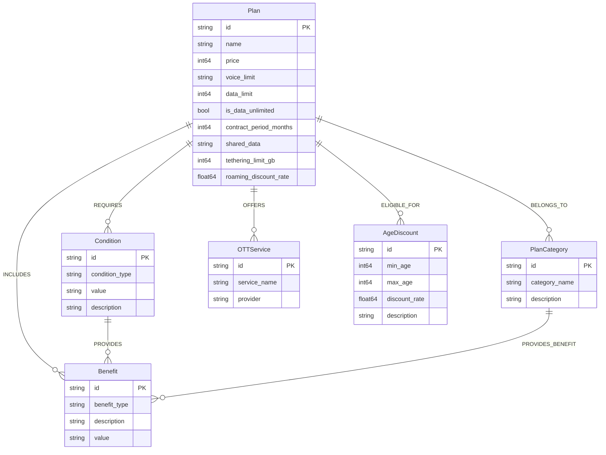

# LG U+ 5G Plan Graph Schema Prototype & App

이 프로젝트는 LG U+ 5G 요금제 설계 에이전트의 입력 사양(`prototyping.md`)을 바탕으로 그래프 데이터베이스 스키마를 작성하고, 이를 시각적으로 탐색 및 조회할 수 있는 웹 어플리케이션 프로토타입입니다.

## 📂 파일 구성 요소

- `app.py`: FastAPI와 Neo4j 드라이버를 활용해 구성된 백엔드 및 정적 파일 서버 애플리케이션입니다. 사용자 요청에 따라 DB를 조회합니다.
- `static/`: HTML, CSS, JS 파일이 포함된 사용자 인터페이스(UI) 폴더로, 요금제 목록과 혜택을 시각적으로 제공합니다.
- `schema.cypher`: Neo4j 5.x의 `CREATE CONSTRAINT ... FOR ... REQUIRE ... IS UNIQUE` 문법과 노드/엣지 생성 테스트(MERGE)가 포함된 Cypher 쿼리 스크립트 파일입니다.
- `neo4j_runner.py`: Python 코드로 `schema.cypher` 파일의 내용을 파싱하고 Neo4j 데이터베이스에 연결하여 스키마 초기화 및 제약조건, 노드, 엣지를 일괄 생성하는 스크립트입니다.
- `schema_spanner.ddl`: Google Cloud Spanner Property Graph를 위한 DDL 스크립트입니다.
- `prototyping.md`: 요금제의 분석 스펙을 정의한 원본 데이터.

## 🚀 Walkthrough (실행 및 동작 확인)

### 1️⃣ 환경 설정 및 실행
Python 가상 환경 설정과 패키지 설치를 완료한 후, 루트 디렉토리의 `.env` 파일에 Neo4j 인증 정보(`NEO4J_URI`, `NEO4J_USERNAME`, `NEO4J_PASSWORD`)를 기입합니다.

**데이터베이스 초기화 (Initial Data Load)**
```bash
python neo4j_runner.py
```
> 위 스크립트를 실행하면 `schema.cypher` 안의 모든 노드, 관계, 제약조건이 Neo4j 브라우저에 배포됩니다. 샘플 조회 질의에 대한 결과는 `neo4j_test_results.md` 파일로 추출되어 올바른 스키마 생성을 검증할 수 있습니다.

**서버 실행 (Start the Application)**
```bash
uvicorn app:app --reload
# 또는 python app.py 실행 시 127.0.0.1:8000에 호스팅됩니다.
```
- 브라우저에서 `http://127.0.0.1:8000/`로 접속하여 "LG U+ 5G Consultant" 화면을 볼 수 있습니다.

### 2️⃣ 앱 핵심 기능 및 API Endpoint

애플리케이션은 그래프 데이터베이스를 조회하여 혜택과 요금제를 매핑하고 클라이언트에 전달합니다.
- `GET /api/plans` : 모든 5G 요금제를 쿼리합니다. OTT 팩 혜택, 카테고리 관계(`BELONGS_TO`), 부가 혜택(`INCLUDES`) 등이 배열 형태로 조인되어 반환됩니다.
- `GET /api/query/youth` : 그래프 모델 내의 `AgeDiscount` 엔티티와 관계(`ELIGIBLE_FOR`)를 탐색하여 만 34세 이하 고객에게 적용되는 할인된 요금제 및 할인 정보를 리턴합니다.
- `GET /api/query/family` : `Condition (Family)` 노드와 요금제 제약 조건(`REQUIRES`)을 분석하여 가족 결합과 관련된 베네핏 명세(`PROVIDES`)를 가져옵니다.

---

## 🏗 Graph Model Visualization (Mermaid)

다음은 DDL과 Neo4j 모델 공통으로 사용된 엔티티 및 연결 관계 모델(Edges) 다이어그램입니다.



## 📝 데이터 매핑 규칙 (Graph schema modeling)

정형화된 데이터를 Spanner DDL 컬럼 및 Cypher 프로퍼티 그래프 속성으로 매핑할 때는 다음 규칙을 따랐습니다:

- **`price` (월 이용료)**: 문자열 기호를 제거한 후 `INT64`로 변환하여 저장합니다. (예: `130000`)
- **`data_limit` (데이터)**: `"무제한"`일 경우 매우 큰 값이나 `-1`을 입력하고, `is_data_unlimited` 플래그를 `true`로 설정합니다. 유한한 데이터는 `INT64` 캐스팅 후 플래그를 `false`로 설정합니다.
- **관계 데이터 (OTT 팩, 스마트기기, 카테고리)**: `Plan` 테이블 컬럼에 단순 저장하지 않고, 다대다(M:N) 및 조건별 검색 등을 구체화하기 위해 해당 외부 엔티티(`#Benefit`, `#PlanCategory` 등)와의 인접 엣지 테이블 및 관계(`BELONGS_TO`, `OFFERS` 등)로 명확히 이어주었습니다. 

이를 통해 복잡한 자연어 질문(예: *"만 34세 이하면서 OTT 서비스가 포함되고 가격이 9만원 이하인 요금제"*)도 유연한 Graph Query(Cypher/GQL)로 해결할 수 있도록 설계되었습니다.
