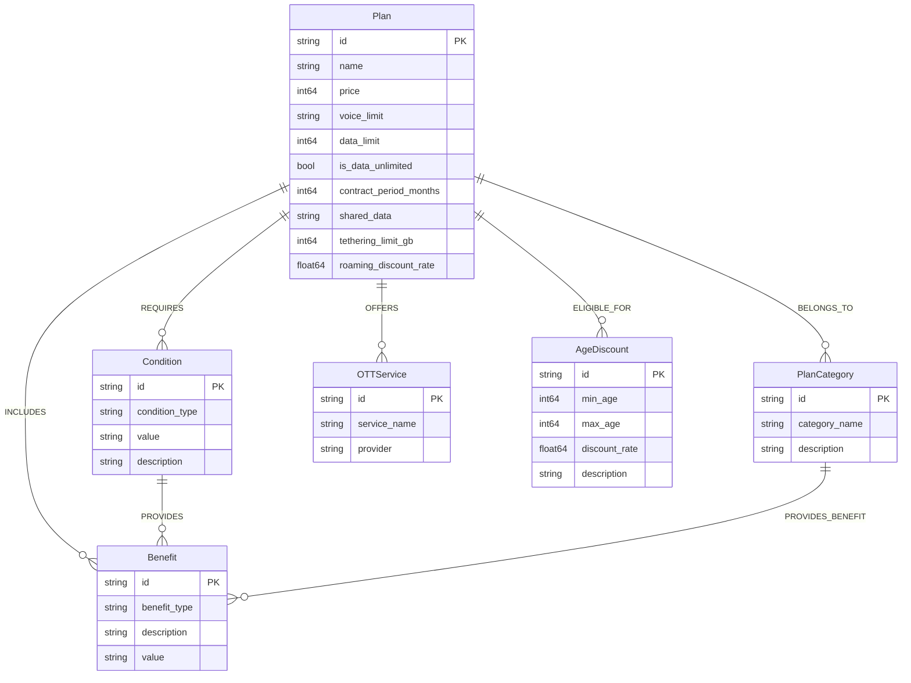

# LG U+ 5G Plan Graph Schema Prototype

이 프로젝트는 LG U+ 5G 요금제 설계 에이전트의 입력 사양(`prototyping.md`)을 바탕으로 그래프 데이터베이스 스키마를 작성한 프로토타입입니다. 

## 파일 구성 요소

- `schema.cypher`: Neo4j 5.x의 `CREATE CONSTRAINT ... FOR ... REQUIRE ... IS UNIQUE` 문법과 노드/엣지 생성 테스트(MERGE)가 포함된 Cypher 쿼리 스크립트 파일입니다.
- `schema_spanner.ddl`: Google Cloud Spanner Property Graph를 위한 DDL 스크립트입니다. `Plan` 엔티티의 핵심 속성(`price`, `data_limit`, `is_data_unlimited` 플래그, `contract_period_months` 등 NOT NULL 제약)이 명확하게 Spanner 스키마 수준에서 정의되어 있으며 `CREATE PROPERTY GRAPH` 문의 `SOURCE/DESTINATION KEY` 연결이 명시되어 있습니다.
- `prototyping.md`: 요금제의 분석 스펙을 정의한 원본.

## Graph Model Visualization (Mermaid)

다음은 Spanner DDL과 Neo4j 스크립트에서 사용된 엔티티 및 이들 간의 연결 관계(Edges)를 요약한 다이어그램입니다.



## 검증 방법 (Verification)

1. **Spanner Graph DDL 실행**: `schema_spanner.ddl`에 포함된 코드를 복사하여 Google Cloud 유효성을 검사합니다.
2. **Neo4j Cypher 테스트**: 최신 5.x 버전의 Neo4j Browser에서 `schema.cypher`를 실행하여 제약조건과 샘플 데이터가 렌더링되는지 점검합니다.

## 데이터 매핑 규칙 (Input 4 표 데이터 기준)

정형화된 표 데이터(예: "입력 방법 4")를 Spanner DDL 컬럼 및 Cypher 속성으로 매핑할 때는 다음 규칙을 따릅니다:

- **`price` (월 이용료)**: `"130,000원"` 등의 문자열에서 쉼표(,)와 '원' 기호를 제거한 후 `INT64`로 변환하여 저장합니다. (예: `130000`)
- **`data_limit` (데이터)**: `"무제한"`일 경우 `-1` (또는 매우 큰 999999 등)을 입력하고, `is_data_unlimited` 플래그를 `true`로 설정합니다. `"40GB"` 등 수치가 제공될 경우 `INT64` (40)으로 캐스팅 후 플래그를 `false`로 설정합니다.
- **`shared_data` (공유 데이터)**: `"60GB+60GB"` 등 복합 문자열 형식이 존재하므로 파싱 없이 `STRING(50)`으로 원형 그대로 보존합니다.
- **관계 데이터 (OTT 팩, 스마트기기, 카테고리)**: `Plan` 테이블의 컬럼에 넣지 않고, 각 요금제 생성 시 해당 외부 엔티티(`#Benefit`, `#PlanCategory`)의 ID와 외래 키 조합으로 인접 엣지 테이블(`EDGE TABLES`)에 `INSERT` 혹은 `MERGE` 관계를 이어줍니다.

## 입력 1~4 기반 설계/검증 프로세스

이 프로젝트는 v0 기초 스키마를 시작으로, 다음의 확장 프로세스를 통해 검증되고 고도화되었습니다.
1. **Input 1 (간단한 비즈니스 로직)**: 속성 구성 완비성 검증 (누락되었던 `voice_limit` 속성 추가 반영).
2. **Input 2 (상세 요금제 정보)**: `Plan` 구조 확장 (`tethering_limit_gb`, `roaming_discount_rate` 등 DDL 반영) 및 4종 요금제를 포함한 11개 노드와 대규모 매핑(`MERGE`) 확장 스크립트 작성.
3. **Input 3 (자연어 요구사항 방침)**: 단순한 `Plan->Benefit` 구조를 넘어, 조건이나 카테고리가 혜택을 발생시키는 고난이도 다이내믹 엣지 생성 (`Condition -> Benefit`, `PlanCategory -> Benefit`).
4. **Input 4 (표 데이터)**: Spanner DDL과 Entity 간 명시적 캐스팅 규칙 확립(위 '매핑 규칙' 단락).

### 샘플 쿼리 (Sample Queries)

생성된 데이터베이스 스키마와 데이터를 활용해 유의미한 정보를 즉각 도출할 수 있습니다.

#### Neo4j (Cypher)

**1. 5G 프리미어 카테고리에 속한 모든 요금제 검색**
```cypher
MATCH (p:Plan)-[:BELONGS_TO]->(c:PlanCategory {category_name: '5G 프리미어'})
RETURN p.name AS PlanName, p.price AS Price, p.data_limit AS DataLimitGB;
```

**2. 만 34세 이하 할인이 가능한 요금제 검색**
```cypher
MATCH (p:Plan)-[:ELIGIBLE_FOR]->(a:AgeDiscount)
WHERE a.max_age <= 34
RETURN p.name AS PlanName, a.description AS DiscountInfo;
```

#### Google Cloud Spanner Graph (GQL)

**1. 5G 프리미어 카테고리에 속한 모든 요금제 검색**
```sql
GRAPH LGUPlusPlanGraph
MATCH (p:Plan)-[:BELONGS_TO]->(c:PlanCategory {category_name: '5G 프리미어'})
RETURN p.name AS PlanName, p.price AS Price, p.data_limit AS DataLimitGB;
```

**2. 만 34세 이하 할인이 가능한 요금제 검색**
```sql
GRAPH LGUPlusPlanGraph
MATCH (p:Plan)-[:ELIGIBLE_FOR]->(a:AgeDiscount)
WHERE a.max_age <= 34
RETURN p.name AS PlanName, a.description AS DiscountInfo;
```
